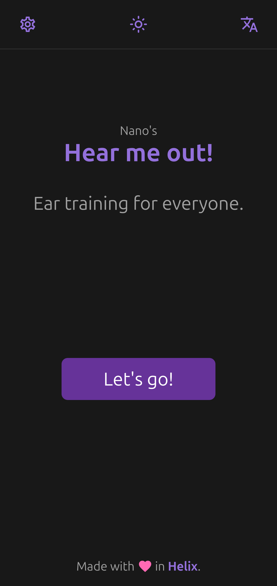

# Hear me out!

**Ear training for everyone.**

An application for musicians to learn the (tempered) intervals.

> [!IMPORTANT]
> Early stages of defelopment (this is not a working app yet).

>[!NOTE]
> **AI Disclosure:**
> None of the contents of this repo was **AI** generated (not that there's anything wrong with that).

